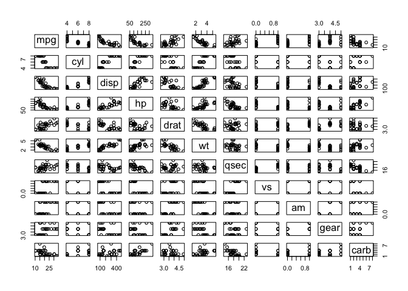

Programming Background
================
Jessica Ayers
2023-06-08

``` r
knitr::opts_chunk$set(fig.path = "../images/")
```

## Prompt

**Everyone in this course had some programming experience coming in (due
to the prerequisites). What are your thoughts on R vs whatever other
software you’ve used? What functionality do you like about R? What parts
do you miss about your other language? Do you consider R a difficult
language to learn? (If you knew R prior to the course, describe your
experience when first learning it.)**

The majority of my programming experience has been in either SAS or R.
I’ve worked with SAS more, but I have seen that many individuals in the
work force rely on R more. That is one of the major reasons that I am
taking this class; to be proficient in SAS and R is my goal. One thing I
like about R is how organized everything can be. With access to R
projects, R Markdown, and using R script, I can work with data easily.
One thing I miss about SAS is that it is not case sensitive. I think R
takes practice. Similar to many programming languages, the foundation is
very similar across languages, but the specifics are different. The more
you work with it, the easier it becomes!

## Example Output from R Markdown

``` r
plot(mtcars)
```

<!-- -->
