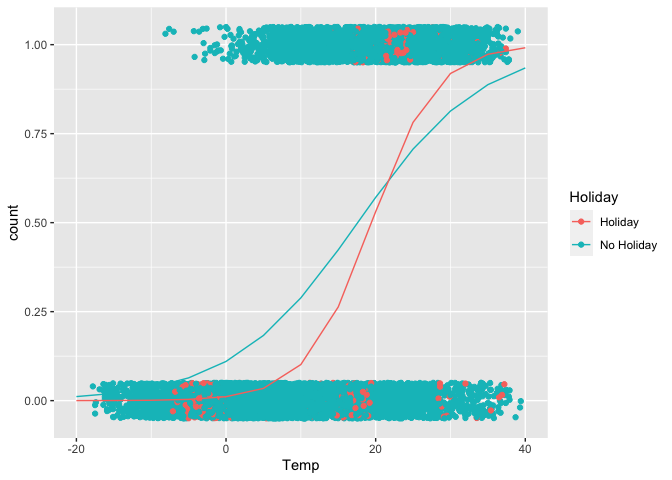

Reflection on R
================
Jessica Ayers
2023-06-27

## Reflection Post

I have worked with R in many statistics classes thus far in my academic
career, but being exposed to the amount of different visuals that can be
created for different processes has been the coolest thing I have
learned about programming in R. Making an ordinary plot is mostly
simple, but creating a plot with color, groups, different attributes,
etc takes more time. In this past module 8, there was one visual that I
found very interesting. It shows a regression trend for different
prediction values.

Using the Seoul Bike Data:

``` r
library(ggiraphExtra)
library(tidyverse)
bikeData <- read_csv("/Users/jessayers/Documents/ST 558/TOPIC 3/SeoulBikeData.csv",  locale=locale(encoding="latin1"))
bikeData
```

    ## # A tibble: 8,760 × 14
    ##    Date       `Rented Bike Count`  Hour `Temperature(°C)` `Humidity(%)` `Wind speed (m/s)` `Visibility (10m)`
    ##    <chr>                    <dbl> <dbl>             <dbl>         <dbl>              <dbl>              <dbl>
    ##  1 01/12/2017                 254     0              -5.2            37                2.2               2000
    ##  2 01/12/2017                 204     1              -5.5            38                0.8               2000
    ##  3 01/12/2017                 173     2              -6              39                1                 2000
    ##  4 01/12/2017                 107     3              -6.2            40                0.9               2000
    ##  5 01/12/2017                  78     4              -6              36                2.3               2000
    ##  6 01/12/2017                 100     5              -6.4            37                1.5               2000
    ##  7 01/12/2017                 181     6              -6.6            35                1.3               2000
    ##  8 01/12/2017                 460     7              -7.4            38                0.9               2000
    ##  9 01/12/2017                 930     8              -7.6            37                1.1               2000
    ## 10 01/12/2017                 490     9              -6.5            27                0.5               1928
    ## # ℹ 8,750 more rows
    ## # ℹ 7 more variables: `Dew point temperature(°C)` <dbl>, `Solar Radiation (MJ/m2)` <dbl>, `Rainfall(mm)` <dbl>,
    ## #   `Snowfall (cm)` <dbl>, Seasons <chr>, Holiday <chr>, `Functioning Day` <chr>

Similar to homework 8, we can turn the rented bike counts variable into
a binary 0/1 for counts of over 700.

``` r
bikeData$count <- 0
for(i in 1:nrow(bikeData)){
  if(bikeData$`Rented Bike Count`[i]>=700){
    bikeData$count[i] <- 1
  }
  else{
    bikeData$count[i] <- 0
  }
}

bikeData <- bikeData %>%
  rename("Temp" = "Temperature(°C)")
```

Now we can fit a poisson model using `count` as the response variable
and `temperature` and `holiday` as the predictor variables.

``` r
glmFit <- glm(count ~ Temp*Holiday, data = bikeData, family = "binomial")
```

Now we can plot the predicted values of this regression.

``` r
ggPredict(glmFit)
```

<!-- -->
